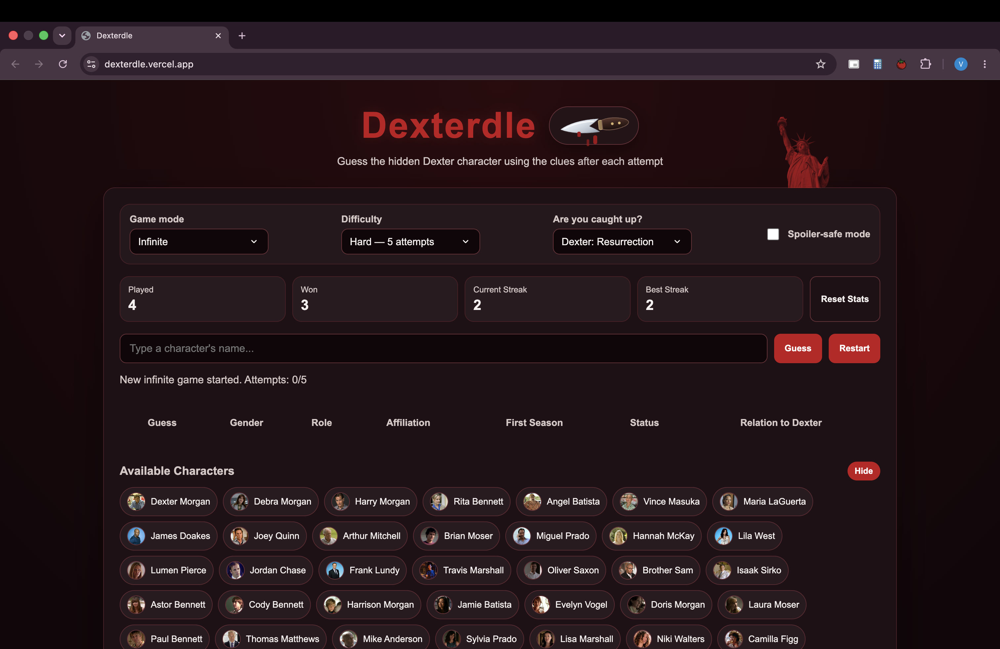
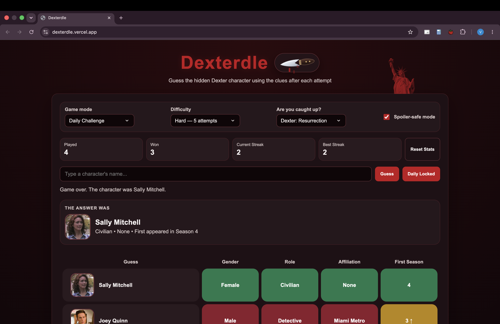
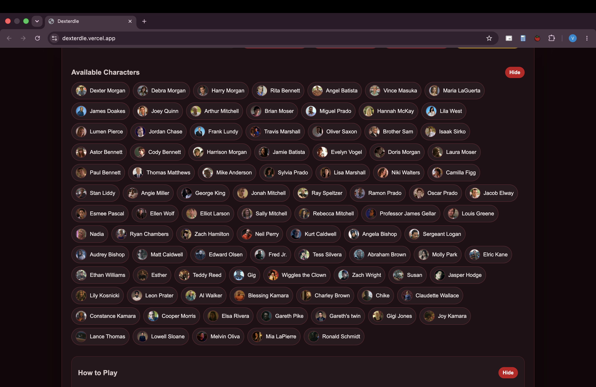
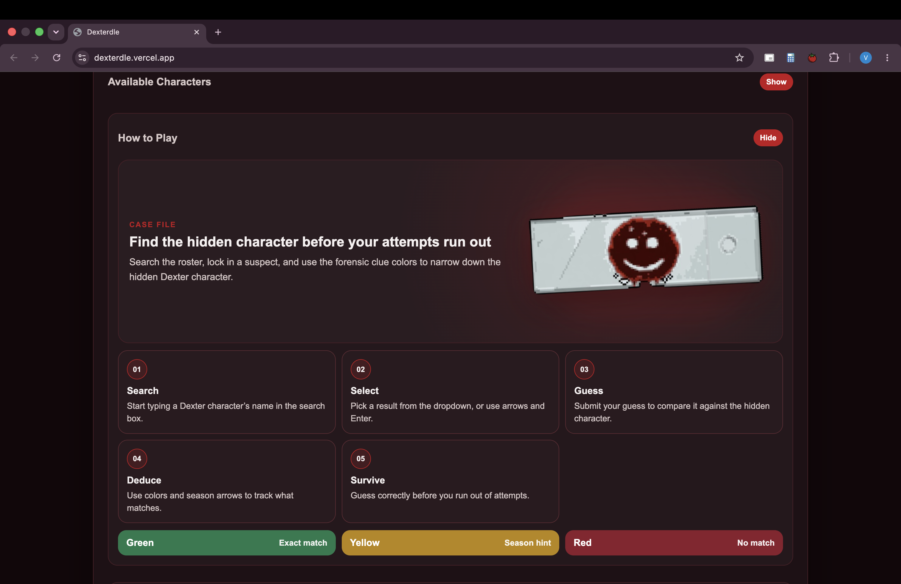
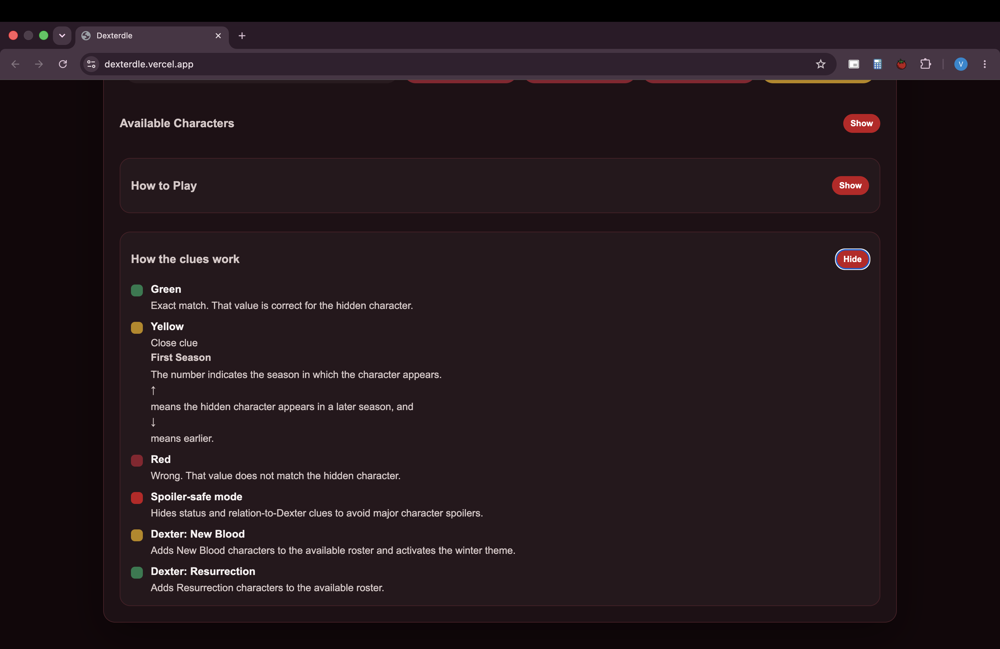

# Dexterdle

Dexterdle is a Dexter-themed character guessing game inspired by Wordle-style deduction games. The player guesses a hidden character and receives color-coded feedback based on shared attributes such as gender, role, affiliation, first season, status, and relation to Dexter

## Preview

## Live Demo

Play Dexterdle here: https://dexterdle.vercel.app/

## Features

- Character guessing game built with HTML, CSS, JavaScript, and jQuery
- Daily Challenge mode with one puzzle per day
- Infinite mode for unlimited random games
- Content modes for Original Series, New Blood, and Resurrection
- Custom searchable dropdown with keyboard navigation
- Image-backed character data
- Color-coded clue feedback
- Difficulty modes with dynamic attempt limits
- Spoiler-safe mode that hides status and relation-to-Dexter clues
- Persistent daily progress using localStorage
- Persistent game statistics and saved user preferences using localStorage
- Light/dark mode toggle with CSS variables
- Themed UI styling with custom visual assets and dynamic effects
- jQuery-powered UI animations and collapsible sections
- Responsive layout

## How to Play

1. Type a character name into the search bar
2. Select a character from the dropdown
3. Submit your guess
4. Use the color feedback to narrow down the hidden character
5. Guess correctly before you run out of attempts

## Clue System

- Green: exact match
- Yellow: close clue for first season
  - ↑ means the hidden character appears in a later season
  - ↓ means the hidden character appears in an earlier season
- Red: no match

## Tech Stack

- HTML
- CSS
- JavaScript
- jQuery
- Vercel Serverless Functions
- localStorage

## Project Architecture

The project is split by function:

- `api/daily.js handles daily puzzle selection through a Vercel serverless function
- data.js contains structured character data
- css/theme.css handles color variables and light/dark mode
- css/title-knife.css handles the animated knife theme toggle
- css/game.css handles the clue table and answer reveal card
- css/sections.css handles dropdowns, character lists, and help sections
- js/state.js stores shared DOM references and game state
- js/game.js handles the core guessing logic, game modes, and daily challenge flow
- js/search.js handles the custom search dropdown
- js/render.js handles DOM rendering
- js/storage.js handles localStorage stats, settings, and daily progress
- js/theme.js handles the theme toggle and audio behavior
- js/events.js connects UI events to game logic
- js/jquery-ui.js contains jQuery-powered UI animations

## Technical Highlights

- Uses structured JavaScript character data to drive game logic
- Separates state, rendering, search, storage, theme, and event behavior across modular files
- Implements keyboard-friendly search with ArrowUp, ArrowDown, Enter, and Escape
- Adds Daily Challenge sand Infinite game modes with separate gameplay behavior
- Uses a Vercel serverless function to provide the daily puzzle target
- Persists daily guesses, game completion state, statistics, and settings across sessions
- Uses CSS custom properties for theme switching
- Uses jQuery for UI animation while keeping core game logic in vanilla JavaScript
- Includes spoiler-safe behavior for hiding sensitive clues

## Future Improvements

- Shareable results
- More spoiler-safe customization
- Additional character filters and clue types
- Server-side guess validation for stronger anti-cheat behavior
- React/TypeScript version
- Unit tests for comparison logic

## Disclaimer

Dexterdle is a fan-made, non-commercial portfolio project created for educational purposes. Dexter and related character names, images, audio, and references belong to their respective copyright holders. I do not claim ownership of any Dexter-related assets used in this project

This project is not affiliated with, endorsed by, or sponsored by the owners of Dexter

## License

The source code is licensed under the MIT License. Dexter-related names, images, audio, and references are not covered by this license and belong to their respective owners
